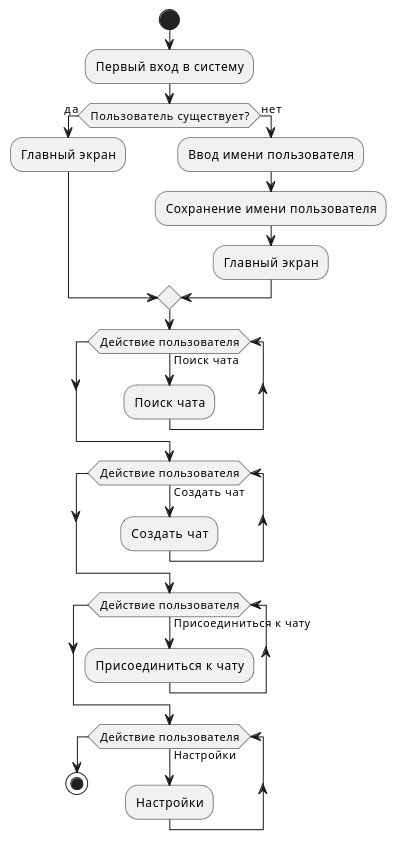

# p2p-chat-udsu
A secure and anonymous P2P messaging app with encryption and cross-platform support 🐍🐍🐍

# mind map
mindmap
  root((P2P-мессенджер))
    Функционал
      Чат
        Текстовые сообщения
        Вложения
        Групповые чаты
      Подключение
        Поиск пиров
        Обмен IP-адресами
        WebRTC-сессия
      Безопасность
        End-to-end шифрование
        Подписи сообщений
    Архитектура
      Протоколы
        WebRTC
        Yggdrasil
        STUN/TURN
      Данные
        Локальное хранилище
        Метаданные
        Кеширование
    Интерфейс
      Android
        KivyMD
        Material 3 Design
      Windows/Linux
        Стандартная тема (похожая на Qt)
        Консольный чат
    Платформы
      Windows
      Linux
      Android
    Разработка
      Языки
        Python
      Клиент
        KivyMD (Android)
        Qt (возможный вариант)
      Библиотеки
        WebRTC
        Yggdrasil
    Тестирование
      Отладка
      Баг-репорты
      Инструменты
